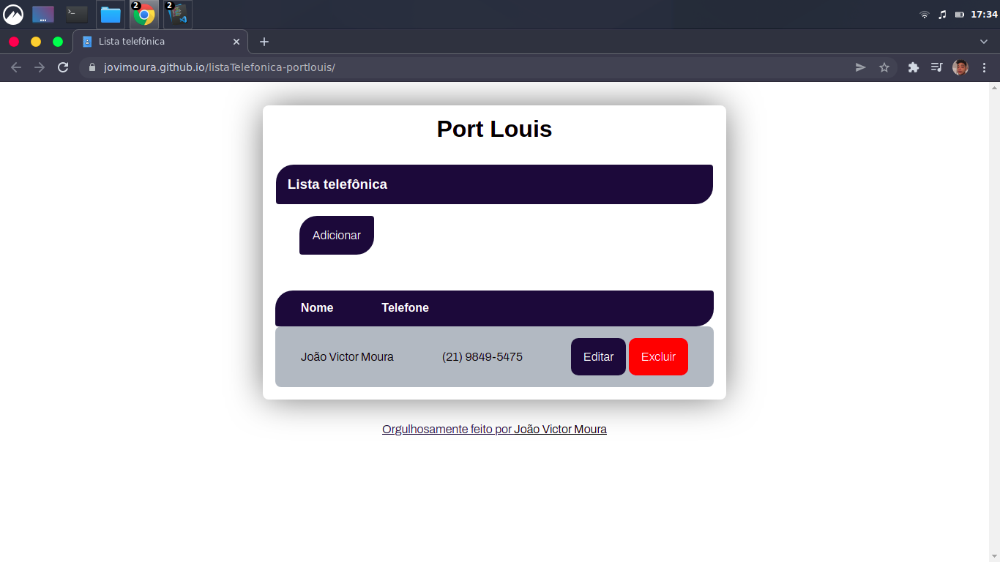

# Lista Telefônica🚀

Este é um projeto que desenvolvi no processo seletivo da Port Louis, trata-se de uma lista telefonica feita com VueJS CDN e Vuetify.

## Como foi feito?🤔

Foram utilizadas algumas funções básicas encontradas no vue, como o v-for, e a lib Vuetify para a estilização e algumas animações.

## Confira o projeto no link:😃

```
https://jovimoura.github.io/listaTelefonica-portlouis/
```
 
## Imagem do projeto 🖥️:


## Tecnologias utilizadas:🦉

<ul>
  <li>VueJS</li>
  <li>Vuetify</li>
  <li>JavaScript</li>
  <li>HTML</li>
  <li>CSS</li>
</ul>

## Autor:😎
## João Victor Moura
## Email: joaovictors.mouraa@gmail.com
## <a href="https://www.linkedin.com/in/jovimoura10/">LinkedIn</a>
